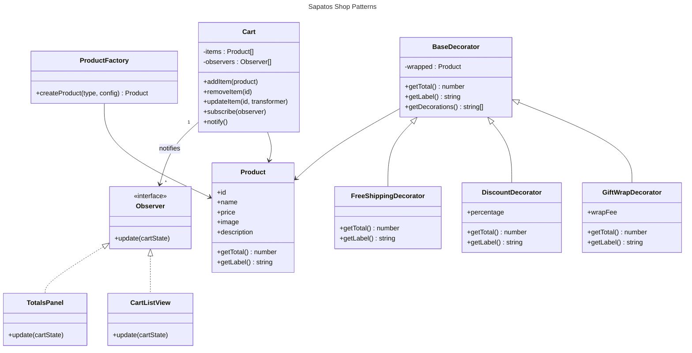

# Sapatos – Design Plan

## Project Vision
Deliver a simple, friendly mini e-commerce experience for a local shoe boutique. Shoppers can browse a curated set of shoes, add them to a cart, and optionally apply add-ons like gift wrap or discounts while the totals update instantly.

## Functional Requirements
- Display a small catalog (at least 3 shoe styles) with name, price, description, and image.
- Add/remove items from the cart; adjust quantities while persisting selections during the session.
- Apply optional add-ons per cart item (gift wrap, discount, free shipping) without modifying core product data.
- Recalculate cart totals automatically whenever products or add-ons change.
- Provide clear subtotals, applied add-ons, and final total.

## Key Design Patterns
- **Product Factory (Creational):** centralizes how different shoe products are instantiated from catalog metadata.
- **Decorator (Structural):** wraps `Product` instances with add-on behavior (gift wrap, discount, free shipping) without touching the base class.
- **Observer (Behavioral):** keeps UI widgets (cart list, totals summary, badge count) in sync with cart state changes.

## Domain Model


## Interaction Sketch
1. **Catalog Render:** On load, the factory creates shoe products from the catalog array and renders cards.
2. **Add to Cart:** Clicking “Add to Cart” pushes a product into the cart store, which notifies observers.
3. **Customize:** Within the cart, toggle gift wrap, discount, or free shipping. Each toggle swaps the item for a decorated version.
4. **Observer Updates:** Registered observers (cart table, totals summary, badge) receive the new cart snapshot and refresh the DOM.
5. **Checkout Prompt:** A simple button can be extended later; currently it clears the cart and shows a thank-you toast.

## UI Layout Plan
- **Header:** brand logo on the left, cart badge on the right.
- **Hero:** short tagline encouraging shoppers.
- **Catalog Section:** responsive cards (3-wide on desktop, stack on mobile).
- **Cart Sidebar:** lists selected items, quantity selectors, add-on toggles, subtotal and final total.

## Data Structures
```text
ProductConfig {
  id: string,
  type: "sneaker" | "runner" | "boot",
  name: string,
  price: number,
  image: string,
  description: string
}

CartState {
  items: DecoratedProduct[],
  totals: {
    base: number,
    adjustments: number,
    grandTotal: number
  }
}
```

## Edge Cases Considered
- Applying multiple decorators in different orders (decorators track applied labels).
- Removing items updates totals and badge correctly.
- Discount never drops price below zero (clamped in decorator).
- Observers safely ignore updates if DOM elements are missing (guards for simple degradation).

## Implementation Roadmap
1. Wire the static HTML scaffolding for layout.
2. Build styling for clean, simple presentation.
3. Implement `ProductFactory` and base product classes in JavaScript.
4. Implement decorators for gift wrap, discount, and free shipping.
5. Implement `Cart` with observer support and DOM observers (cart list, totals, badge).
6. Connect UI interactions (add to cart, quantity adjustments, decorator toggles).
7. Perform manual test passes for add/remove, toggles, and totals.
